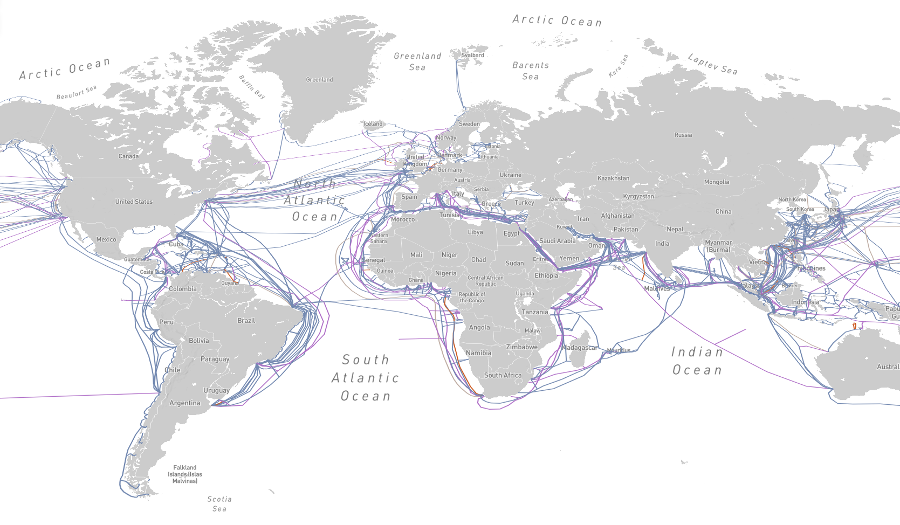

# MAC адрес

**MAC адрес** (*media access control*) — это уникальный номер сетевого оборудования (компьютера, сервера, роутера, порта коммутатора, да чего угодно). Представляет собой уникальную комбинацию шестнадцатиричных цифр длиной 6 байт. Присваивается такой номер еще на фабрике, то есть в момент производства.

MAC адрес еще называют уникальным физическим адресом устройства, помогающим идентифицировать устройство среди миллионов других устройств. В любой посылке, передаваемой по проводной сети, присутствуют MAC-адреса источника и назначения.

Обычно MAC записывается как шесть шестнадцатеричных чисел, разделенных двоеточием: **00:AB:CD:EF:11:22**, хотя некоторые производители  оборудования предпочитают запись вида **00-AB-CD-EF-11-22** и даже  **00ab.cdef.1122**.

Исторически адреса присваивались оборудованию без возможности их модификации, но в настоящее время  адрес может быть изменен программно, из операционной системы. Задать  вручную МАС адрес сетевой карте можно в Linux и MacOS (всегда), Windows  (почти всегда, если позволит драйвер), Android (только рутованный); а вот с iOS (без рута) подобный трюк невозможен.

## Формат MAC адреса

<figure markdown>
  
  <figcaption>Карта подводных кабелей</figcaption>
</figure>

Вторые три байта назначаются производителем оборудования по его усмотрению.

<figure markdown>
  
  <figcaption>Формат MAC адреса</figcaption>
</figure>

!!! note "Как узнать свой MAC адрес в ОС Windows"

    Чтобы узнать MAC - адрес в Windows системах, откройте командную строку машины. Сделать это можно нажав комбинацию клавиш Win + R, ввести cmd и нажать Enter. Как только откроется консоль, дайте следующие команду: `ipconfig /all`

## Отслеживание людей с помощью MAC адресов

Компании и учреждения используют MAC адреса для отслеживания местоположения устройств. По мере перемещения устройства (и человека с ним) из точки WiFi в точку WiFi, оно продолжает передавать свой MAC адрес для подключения к новым точкам WiFi. В большом здании (например, в аэропорту) или городе можно использовать единую систему WiFi для отслеживания местоположения пользователей и сбора информации об их передвижениях.

Но для этого требуется доступ ко многим точкам WiFi, что обычно доступно только крупным компаниям. Использование отслеживания MAC адресов также не всегда плохо — в некоторых частях мира они просто используются для измерения скорости и потока трафика.
Однако есть и примеры злоупотреблений.

## Список использованных источников

1. Всё, что вы хотели знать о МАС адресе [Электронный ресурс] URL: [https://habr.com/ru/post/483670/](https://habr.com/ru/post/483670/) (дата обращения: 09.03.2022)
1. Что такое MAC - адрес и как его узнать? [Электронный ресурс] URL: [https://wiki.merionet.ru/seti/28/chto-takoe-mac-adres-i-kak-ego-uznat/](https://wiki.merionet.ru/seti/28/chto-takoe-mac-adres-i-kak-ego-uznat/) (дата обращения: 09.03.2022)
1. Исхаков М. MAC-адрес: что это такое и как он работает? [Электронный ресурс] URL: [https://bezopasnik.info](https://bezopasnik.info) (дата обращения: 09.03.2022)