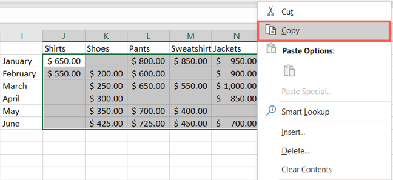
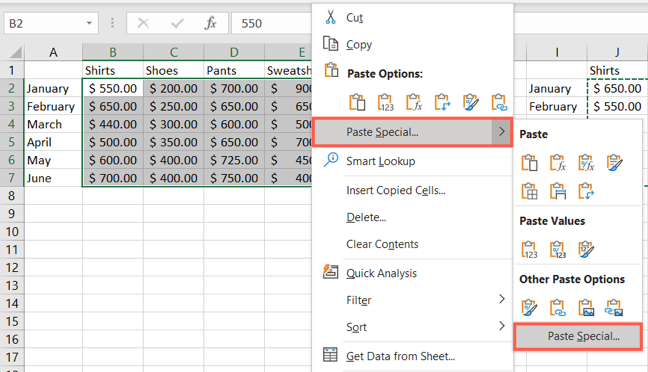
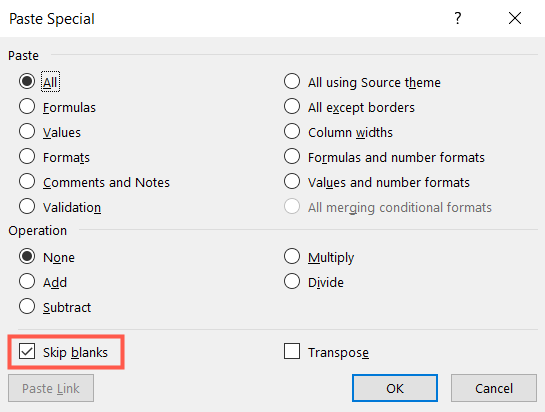

# Варианты вставки из Excel

## Что такое Microsoft Excel

Microsoft Excel – программа для работы с электронными таблицами,
созданная корпорацией Microsoft для Microsoft Windows, Windows NT и Mac OS,
а также Android, iOS и Windows Phone.

## Доступные виды вставки

В Excel существует несколько вариантов вставки данных:

### Вариант 1: Обычная вставка

Если вам необходимо добавить в текстовый документ Ворд файл Эксель в его
законченном виде, то есть когда в дальнейшем никаких изменений в изначальную
книгу вносить не планируется, выполните следующее:

1. Перейдите в папку с файлом таблицы, выделите его и скопируйте,
воспользовавшись соответствующим пунктом контекстного меню или сочетанием
клавиш «Ctrl+C».
2. Откройте документ Ворд и установите указатель курсора в том месте,
где должна быть выполнена вставка. Любым удобным способом вставьте
скопированную книгу Excel, например, выбрав пункт в контекстном меню или
воспользовавшись сочетанием «Ctrl+V».
3. Отдельно стоит рассмотреть вставку содержимого буфера обмена
через соответствующую кнопку на панели инструментов – непосредственное
нажатие на нее интегрирует файл электронной таблицы в текстовый документ
аналогично использованию клавиш.

### Вариант 2: Вставка со связкой

В том же случае, если требуется сделать так, чтобы вносимые в изначальную
книгу Excel изменения отражались на ее копии в документе Word и наоборот,
в меню специальной вставки, рассмотренном на последнем шаге инструкции выше,
потребуется изменить один из параметров.

1. Скопируйте файл таблицы и перейдите к текстовому документу. Установите
указатель курсора в нужном месте.
2. Разверните меню кнопки «Вставить» на ленте и выберите
пункт «Специальная вставка».
3. Установите маркер напротив расположенного слева параметра «Связать»,
в основной области выберите «Files», поставьте галочку в чекбоксе
«В виде значка», по необходимости смените его и подпись.

### Вариант 3: Вставка объекта

Оба предложенных выше решения работают только с локальными файлами,
используемыми на конкретном ПК, то есть если вы передадите документ Word с
внедренной в него таким образом таблицей Excel, открыть ее не получится по
причине фактического отсутствия самого файла. Для того чтобы такая
возможность стала доступной, книгу нужно добавлять в виде объекта.
Делается это следующим образом:

1. Установите указатель курсора в том месте документа, куда требуется
добавить файл таблицы, и перейдите во вкладку «Вставка».
2. Разверните меню кнопки «Объект» и выберите в нем одноименный пункт.
3. В открывшемся окне перейдите во вкладку «Создание из файла» и
нажмите на кнопку «Обзор».
4.С помощью системного «Проводника» переместитесь к папке с книгой Эксель,
выделите ее и нажмите «Вставить».
5. Установите отметку в чекбоксе «В виде значка». Если хотите сохранить
«Связь с файлом» (аналогично решению из части «Вариант 2» настоящей статьи),
отметьте соответствующий пункт.
6. По желанию «Смените значок» и «Подпись» (название).
7. Нажмите «ОК» для закрытия окон и подтверждения вставки.

### Вариант 4: Вставка в виде ссылки

Альтернативой предыдущему методу, причем во многих случаях более
универсальной и простой в своей реализации, является добавление файла
Эксель в виде предварительной созданной и полученной публичной ссылки на него.
Стоит отметить, что такой подход работает как с локальными, так и с удаленными документами (например, сохраненными в облаке) и, в отличие от предложенного
выше решения, позволяет сохранить связь между ними с возможностью
полноценного редактирования и синхронизацией изменений.
Узнать же более детально обо всех его особенностях можно из отдельной инструкции.

### Вариант 5: Вставка таблицы

Если же ваша задача заключается в добавлении не непосредственно файла Эксель,
как объекта, а электронной таблицы, действовать нужно несколько иначе,
чем в любом из предложенных выше решений. На выбор доступно несколько вариантов,
подразумевающих сохранение исходного форматирования, его объединение
с текущим или полную очистку, создание связи и некоторые другие, дополнительные параметры. Более детально обо всех нюансах данной процедуры можно узнать из следующей статьи на нашем сайте.

## Чем отличается копирование-вставка ячеек от копирования-вставки столбцов

При копировании-вставке ячеек осуществляется копирование и вставка тех ячеек,
которые выбрал сам пользователь.
При копировании-вставке столбцов осуществляется копирования и вставка
всех ячеек, расположенных в выбранном столбце.

## Что делать, если вставляются пустые ячейки при копировании столбцов

Если во время копирования и вставки столбцов во время вставки остаются
пустые ячейки, стоит использовать следующий способ:

Выберите ячейки, которые хотите скопировать, и либо щелкните правой кнопкой мыши
и выберите «Копировать», либо перейдите на вкладку «Главная» и нажмите
«Копировать» в разделе «Буфер обмена» на ленте.

Выберите целевые ячейки, в которые вы хотите вставить скопированные ячейки.
Либо щелкните правой кнопкой мыши, выберите «Специальная вставка»
и выберите «Специальная вставка» во всплывающем меню,
либо перейдите на вкладку «Главная», нажмите «Вставить» на ленте
и выберите «Специальная вставка».

Когда откроется окно «Специальная вставка», установите флажок
«Пропустить пробелы» ниже.
Вы можете настроить все остальные параметры в разделах «Вставка» и «Операция».
Нажмите ОК, когда закончите.

## Источники

1. Каиров В. Вставка файла Excel в документ Word [Электронный ресурс]
URL: https://lumpics.ru/how-insert-excel-file-into-word/ (дата обращения: 12.12.2023)
2. Перемещение или копирование ячеек, строк и столбцов [Электронный ресурс]
URL: https://https://support.microsoft.com/ru-ru/office/перемещение-или-копирование-ячеек-строк-и-столбцов-3ebbcafd-8566-42d8-8023-a2ec62746cfc
(дата обращения: 15.12.2023)
3. Как пропустить вставку пустых ячеек при копировании в Microsoft Excel
[Электронный ресурс] URL: https://elsefix.com/ru/how-to-skip-pasting-blank-cells-when-copying-in-microsoft-excel.html (дата обращения: 15.12.2023)
