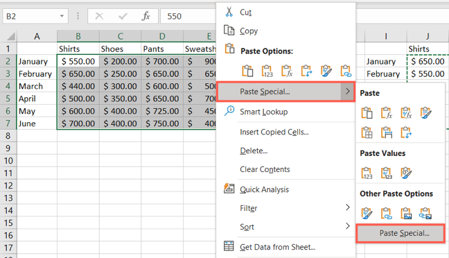
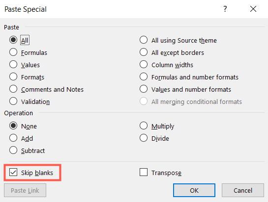

# Варианты вставки из Excel

## Что такое Microsoft Excel

Microsoft Excel – программа для работы с электронными таблицами,
созданная корпорацией Microsoft для Microsoft Windows, Windows NT и Mac OS,
а также Android, iOS и Windows Phone.

## Доступные виды вставки

В Excel существует несколько вариантов вставки данных:

1. Вставка значений: при этом вставляются только значения из выделенных ячеек
или диапазона, без форматирования и формул.
2. Вставка форматов: при этом копируется только форматирование выделенных ячеек
или диапазона, без самих значений или формул.
3. Вставка формул: при этом копируются как значения,
так и формулы из выделенных ячеек или диапазона.
4. Вставка ссылок: это позволяет создавать ссылки на исходные ячейки
или диапазоны, чтобы изменения в оригинальных данных автоматически отражались
в вставленных данных.
5. Вставка специальных значений: под этим подразумевается вставка значений
с определенными атрибутами, такими как даты, числа или текст.
6. Вставка объектов: это позволяет вставлять объекты, такие как изображения,
графики или диаграммы.

## Чем отличается копирование-вставка ячеек от копирования-вставки столбцов

При копировании-вставке ячеек осуществляется копирование и вставка тех ячеек,
которые выбрал сам пользователь.
При копировании-вставке столбцов осуществляется копирования и вставка
всех ячеек, расположенных в выбранном столбце.

## Что делать, если вставляются пустые ячейки при копировании столбцов

Если во время копирования и вставки столбцов во время вставки остаются
пустые ячейки, стоит использовать следующий способ:

Выберите ячейки, которые хотите скопировать, и либо щелкните правой кнопкой мыши
и выберите «Копировать», либо перейдите на вкладку «Главная» и нажмите
«Копировать» в разделе «Буфер обмена» на ленте.

Выберите целевые ячейки, в которые вы хотите вставить скопированные ячейки.
Либо щелкните правой кнопкой мыши, выберите «Специальная вставка»
и выберите «Специальная вставка» во всплывающем меню,
либо перейдите на вкладку «Главная», нажмите «Вставить» на ленте
и выберите «Специальная вставка».

Когда откроется окно «Специальная вставка», установите флажок
«Пропустить пробелы» ниже.
Вы можете настроить все остальные параметры в разделах «Вставка» и «Операция».
Нажмите ОК, когда закончите.

## Источники

1. Тютюшев М. Применение специальной вставки в Microsoft Excel [Электронный ресурс]
URL: https://lumpics.ru/paste-special-in-excel/ (дата обращения: 12.12.2023)
2. Перемещение или копирование ячеек, строк и столбцов [Электронный ресурс]
URL: https://https://support.microsoft.com/ru-ru/office/перемещение-или-копирование-ячеек-строк-и-столбцов-3ebbcafd-8566-42d8-8023-a2ec62746cfc
(дата обращения: 15.12.2023)
3. Как пропустить вставку пустых ячеек при копировании в Microsoft Excel
[Электронный ресурс] URL: https://elsefix.com/ru/how-to-skip-pasting-blank-cells-when-copying-in-microsoft-excel.html (дата обращения: 15.12.2023)
