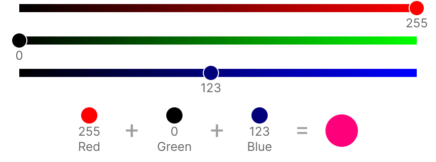

# Запись цвета

Запись цвета отличается для разных моделей представления цвета.

## Модель RGB

**RGB** (**R**ed, **G**reen, **B**lue) — аддитивная цветовая модель, где каждый цвет представляется суммой трех базовых: *красного*, *зеленого* и *синего*. Используется для отображения цвета на экранах.

Каждый из базовых цветов сопоставляется с однобайтовым числом (всего $2^8=256$ значений). $0$ соответствует отсутствию цвета (черный цвет), $255$ соответствует максимальной насыщенности базового цвета. 

<figure markdown>
  
  <figcaption>Сложение в RGB</figcaption>
</figure>

Для записи результирующего цвета используется шаблон `#RRGGBB`, где `RR` — **шестнадцатеричное** число для красного цвета, `GG` — для зеленого, `BB` — для синего. Можно записывать цвет как большими так и маленькими цифрами.

<figure markdown>
  
  <figcaption>Запись цвета в RGB</figcaption>
</figure>

Вторым вариантом обозначения цвета в RGB может выступать запись вида `rgb(R, G, B)`, где `R` — **десятичное** число для красного цвета, `G` — для зеленого и `B` — для синего.

<figure markdown>
  
  <figcaption>Альтернативная запись цвета в RGB</figcaption>
</figure>

Белый цвет соответствует значению `#FFFFFF` или `rgb(255, 255, 255)`.

Модель RGB позволяет определить $2^{24}=16\ 777\ 216$ цветов.

## Модель CMYK

**CMYK** (**C**yan, **M**agenta, **Y**ellow, **K**ey или Black), четырёхцветная субтрактивная цветовая модель. Используемая прежде всего в полиграфии. Она использует голубой, пурпурный, жёлтый  и черный цвета в роли основных.

Экран не может показать цвета в CMYK, он их только имитирует.

Запись цвета в CMYK похожа на RGB, только вместо абсолютных чисел используются проценты — от $0\%$ до $100\%$. Для разных программ запись может отличаться. Например, для записи CMYK на интернет страничке используется запись вида `cmyk(C%, M%, Y%, K%)`, где `C%` — процентное отношение голубого цвета, `M%` — пурпурного, `Y%` — желтого и  `K%` — черного.

<figure markdown>
  
  <figcaption>Запись цвета CMYK</figcaption>
</figure>

## Список использованных источников

1. RGB [Электронный ресурс] URL: [https://ru.wikipedia.org/wiki/RGB](https://ru.wikipedia.org/wiki/RGB) (дата обращения: 16.07.2022)
1. Кодирование цветов [Электронный ресурс] URL: [https://libraryno.ru/5-3-kodirovanie-cvetov-sredotobrinf/](https://libraryno.ru/5-3-kodirovanie-cvetov-sredotobrinf/) (дата обращения: 16.07.2022)
1. Кодирование цветовой информации [Электронный ресурс] URL: [https://www.compgramotnost.ru/kodirovanie-informacii/kodirovanie-cvetovoj-informacii](https://www.compgramotnost.ru/kodirovanie-informacii/kodirovanie-cvetovoj-informacii) (дата обращения: 16.07.2022)
1. Convert A Color [Электронный ресурс] URL: [https://convertacolor.com/](https://convertacolor.com/) (дата обращения: 16.07.2022)