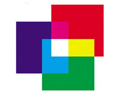
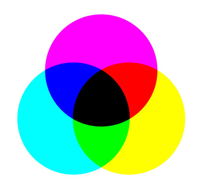

# Цвет

Важнейшей составляющей в понимании определения цвета является **свет** — электромагнитное излучение, воспринимаемое человеческим глазом. 

Именно со света все и начинается. Свет, отражаясь от поверхностей, попадает на сетчатку глаза и вызывает психологическое ощущение называемое **цветом**.

Цвет объекта складывается из цвета света и свойства самого объекта поглащать свет. Если осветить апельсин белым источником света, то апельсин поглатит все цвета, кроме оранжевого. 

Сетчатка глаза содержит примерно 125 миллионов светочувствительных клеток. Они обрабатывают световые частицы, поступающие на них, а мозг, получая эту информацию, трансформирует ее в разнообразие форм и цветов.

Теоретически человеческий глаз способен различать до 10 миллионов цветов. Но реально он отличает всего порядка 100 оттенков, а те, чья профессия связана с цветом, — художники, дизайнеры — около 150.

## Смешение цветов

**Смешение цветов** — процесс получения разнообразных цветов при помощи базовых цветовых излучений или красок.

Существует два различных типа смешения цветов. Это аддитивное (слагательное) смешение и субтрактивное (вычитательное) смешение.

### Аддитивное смешение цветов

Суть аддитивного смешения заключается в **суммировании световых лучей**. Основные цвета, которые чаще всего используются для смешивания в этом случае: 🔴 *красный*, 🟢 *зеленый* и 🔵 *синий*.

<figure markdown>
  
  <figcaption>Аддитивное смешение цветов</figcaption>
</figure>

### Субтрактивное смешение цветов

Суть субтрактивного смешения заключается в вычитании из светового потока какой-либо его части путем поглощения, например при смешении красок.  Основные цвета, которые чаще всего используются для смешивания в этом случае: *циан*, *маджента*, *желтый* и *черный*.

<figure markdown>
  
  <figcaption>Субтрактивное смешение цветов</figcaption>
</figure>

## Список использованных источников

1. Цвет [Электронный ресурс] URL: [https://dic.academic.ru/dic.nsf/ruwiki/12154](https://dic.academic.ru/dic.nsf/ruwiki/12154) (дата обращения: 14.07.2022)
1. Что такое на самом деле цветное зрение [Электронный ресурс] URL: [https://www.linzy.ru/otvety-na-voposy/skolko-cvetov-vidit-chelovek.htm](https://www.linzy.ru/otvety-na-voposy/skolko-cvetov-vidit-chelovek.htm) (дата обращения: 14.07.2022)
