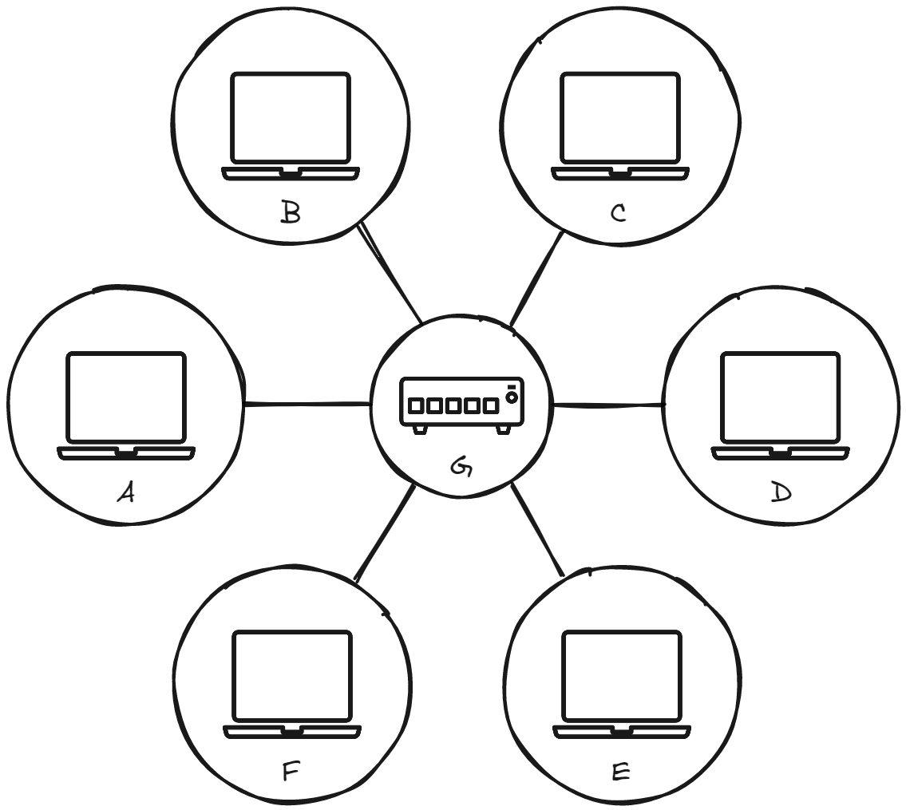
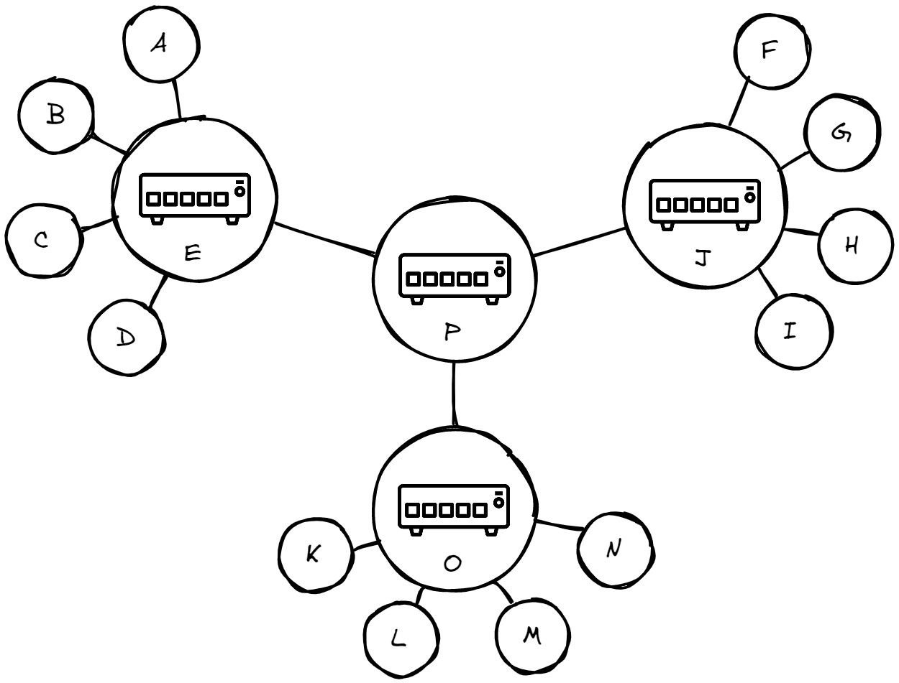

# Построение Сети

Когда нужно связать между собой два компьютера, вы должны связать их в сеть либо проводным, либо беспроводным способом[^1] (например, с помощью WiFi или Bluetooth). Современные компьютеры поддерживают любой из этих способов связи.

[^1]: До конца этой статьи мы будем говорить только о физическом (проводном) способе подключения, но беспроводные сети работают аналогичным образом.

<figure markdown>
  
  <figcaption>Соединение двух компьютеров</figcaption>
</figure>

Таким способом вы можете подключить и более двух компьютеров, но с каждым новым это становится все сложнее. Если хочется подключить, скажем, 6 компьютеров, вам понадобится 15 кабелей и 5 сетевых плат в каждом компьютере!

<figure markdown>
  
  <figcaption>Соединение шести компьютеров</figcaption>
</figure>

## Маршрутизатор

Чтобы решить эту проблему, каждый компьютер в сети подключается к специальному маленькому компьютеру. Этот компьютер называют **маршрутизатором**. Маршрутизатор исполняет только одну роль: как сигнальщик на железной дороге он следит за тем, чтобы пакет, отправленный одним компьютером — источником — достиг пункта назначения. Чтобы отправить сообщение компьютеру B, компьютер A сначала должен отправить его маршрутизатору, который перенаправит его компьютеру B и проконтролирует, чтобы данные не попали компьютеру C.

С добавлением маршрутизатора сеть здорово упрощается: чтобы соединить 6 компьютеров требуется только 6 кабелей (каждый кабель соединяет маршрутизатор с одним из компьютеров).

<figure markdown>
  
  <figcaption>Шесть компьютеров и маршрутизатор</figcaption>
</figure>

## Сеть сетей

Пока все нормально. Но что нам делать, если нужно объединить в сеть сотни, тысячи или миллиарды компьютеров? Конечно, один маршрутизатор не справится с этой задачей, но как вы помните, маршрутизатор — это обычный компьютер, и ничто не мешает нам соединить друг с другом 2 маршрутизатора. Давайте сделаем это.

<figure markdown>
  
  <figcaption>Два маршрутизатора</figcaption>
</figure>

Подключая компьютеры к маршрутизатору, а затем — маршрутизатор к другому маршрутизатору, мы можем увеличивать нашу сеть до сколь угодно больших размеров.

<figure markdown>
  
  <figcaption>Маршрутизаторы соединенные через маршрутизаторы</figcaption>
</figure>

Таким образом можно объединить компьютеры домов, городов, стран, континентов и получить всемирную компьютерная сеть, где каждый может связаться с каждым. 

> Хотели как лучше, а получился Интернет.

<figure markdown>
  
  <figcaption>Карта интернета на 16.01.2021</figcaption>
</figure>

<figure markdown>
  
  <figcaption>Карта подводных кабелей</figcaption>
</figure>

## Список использованных источников

1. Как работает Интернет [Электронный ресурс] URL: [https://developer.mozilla.org/ru/docs/Learn/Common_questions/How_does_the_Internet_work](https://developer.mozilla.org/ru/docs/Learn/Common_questions/How_does_the_Internet_work) (дата обращения: 12.02.2022)
2. Raw Images and Data [Электронный ресурс] URL: [https://www.opte.org/](https://www.opte.org/) (дата обращения: 12.02.2022)
3. Карта подводных кабелей [Электронный ресурс] URL: [https://www.infrapedia.com/app](https://www.infrapedia.com/app) (дата обращения: 12.02.2022)
