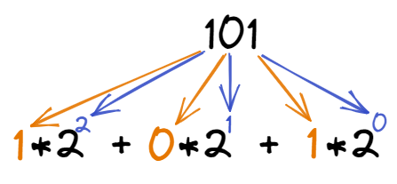

# Системы счисления

**Система счисления** — это способ записи (представления) чисел.

**Число** — мера для описания количества чего-либо.

**Цифры** — знаки, используемые для записи чисел.

<figure markdown>
  
  <figcaption>Цифры и число</figcaption>
</figure>
## Позиционные и непозиционные системы счисления

**Разряд** — это место (позиция), на котором в записи числа стоит цифра. Разряды отсчитываются с конца числа.

**Непозиционная** система счисления — самая древняя, в ней каждая цифра числа имеет величину, не зависящую от её разряда. То есть, если у вас 5 черточек — то число тоже равно $5$, поскольку каждой черточке, независимо от её места в строке, соответствует всего 1 один предмет.

**Позиционная система** — значение каждой цифры зависит от её разряда. Например, привычная для нас 10-я система счисления — позиционная. Рассмотрим число $453$. Цифра $4$ обозначает количество сотен и соответствует числу $400$, $5$ — количество десяток и аналогично значению $50$, а $3$ — единиц и значению $3$. Как видим — чем больше разряд — тем значение выше. Итоговое число можно представить, как сумму $400+50+3=453$.

## Единичная система счисления

Как только люди научились считать — возникла потребность записи чисел. В начале все было просто — зарубка или черточка на какой-нибудь поверхности соответствовала одному предмету, например, одному фрукту. Так появилась первая система счисления — **единичная**.

Число в этой системе счисления представляет собой строку из черточек (палочек), количество которых равно значению данного числа. Таким образом, урожай из 100 фиников будет равен числу, состоящему из 100 черточек.
Но эта система обладает явными неудобствами — чем больше число — тем длиннее строка из палочек. Помимо этого, можно легко ошибиться при записи числа, добавив случайно лишнюю палочку или, наоборот, не дописав.

Для удобства, люди стали группировать палочки по 3, 5, 10 штук. При этом, каждой группе соответствовал определенный знак или предмет. Изначально для подсчета использовались пальцы рук, поэтому первые знаки появились для групп из 5 и 10 штук (единиц). Все это позволило создать более удобные системы записи чисел.

## Десятичная система счисления

**Алфавит** системы счисления — это используемый в ней набор цифр.

**Основание** системы счисления — это количество цифр в алфавите.

Десятичная система счисления — это одна из самых распространенных систем счисления. Именно её мы используем, когда называем цену товара и произносим номер автобуса. В каждом разряде может использоваться только одна цифра из диапазона от $0$ до $9$. Основанием системы является число $10$.

Для примера возьмем число $503$. Если бы это число было записано в непозиционной системе, то его значение равнялось $5+0+3 = 8$. Но у нас — позиционная система и значит каждую цифру числа необходимо умножить на основание системы, в данном случае число $10$, возведенное в степень, равную номеру разряда. Получается, значение равно $5*10^2 + 0*10^1 + 3*10^0 = 500+0+3 = 503$. Чтобы избежать путаницы при одновременной работе с несколькими системами счисления основание указывается в качестве нижнего индекса. Таким образом, $503 = 503_{10}$.

## Двоичная система счисления

Эта система, в основном, используется в вычислительной технике. Почему не стали использовать привычную нам 10-ю? Первую вычислительную машину создал Блез Паскаль, использовавший в ней десятичную систему, которая оказалась неудобной в современных электронных машинах, поскольку требовалось производство устройств, способных работать в 10 состояниях, что увеличивало их цену и итоговые размеры машины. Этих недостатков лишены элементы, работающие в 2-ой системе. Тем не менее, рассматриваемая система была создана задолго до изобретения вычислительных машин и уходит корнями в цивилизацию Инков, где использовались кипу — сложные верёвочные сплетения и узелки.

Двоичная позиционная система счисления имеет основание $2$ и использует для записи числа $2$ символа (цифры): $0$ и $1$. В каждом разряде допустима только одна цифра — либо $0$, либо $1$.

### Из двоичной в десятичную

Для того, чтобы перевести из 2-й в 10-ю необходимо умножить каждую цифру двоичного числа на основание $2$, возведенное в степень, равную разряду. 

Примером может служить число $101_2$.

<figure markdown>
  
  <figcaption>Из двоичной в десятичную</figcaption>
</figure>
$101_2 = 1*2^2 + 0*2^1 + 1*2^0 = 4+0+1 = 5_{10}$.

### Из десятичной в двоичную

Перевести из десятичной системы счисления в двоичную можно с помощью последовательного деления на 2 и записи на каждом из шагов остатков от деления. Полученные остатки от деления переписываются **в обратном порядке**!

Возьмем для примера число $61$

<figure markdown>
  
  <figcaption>Из десятичной в двоичную</figcaption>
</figure>

Таким образом получаем $61_{10}=111101_2$.

## Шестнадцатеричная система счисления

Шестнадцатеричная система широко используется в современных компьютерах, например при помощи неё указывается цвет: `#FFFFFF` — белый цвет. Рассматриваемая система имеет основание $16$ и использует для записи цифры: $0$, $1$, $2$, $3$, $4$, $5$, $6$, $7$, $8$, $9$, $\mathrm{A}$, $\mathrm{B}$, $\mathrm{C}$, $\mathrm{D}$, $\mathrm{E}$, $\mathrm{F}$, где буквы равны $10$, $11$, $12$, $13$, $14$, $15$ соответственно.

### Из шестнадцатеричной в десятичную

Перевод из шестнадцатеричной системы счисления осуществляется также как и из двоичной, только вместо $2$  используется $16$.

Для примера возьмем число $\mathrm{A}6_{16}$.

<figure markdown>
  
  <figcaption>Из шестнадцатеричной в десятичную</figcaption>
</figure>

$\mathrm{A}6_{16} = 10*16^1 + 6*16^0 = 160 + 6 = 166_{10}$

### Из шестнадцатеричной в двоичную

Каждая цифра шестнадцатеричной системы счисления однозначно представляется **четырьмя** двоичными цифрами. Этим свойством мы и воспользуемся для перевода.

!!! note "Напоминание"

    К любому числу в позиционных системах счисления можно бесплатно дописывать слева незначащие нолики. От этого число **не изменится**.
    Например: $17_{10} = 017_{10} = 0 \ldots 017_{10}$

Для простоты подсчетов перевод можно осуществить в два шага. На первом шаге переводим каждую шестнадцатеричную цифру в десятичное число. А на втором шаге переводим полученное число [в двоичную систему](#Из-десятичной-в-двоичную).

Например, число $\mathrm{B}9$:

<figure markdown>
  
  <figcaption>Из шестнадцатеричной в двоичную</figcaption>
</figure>

Получаем число $10110101_2$.

### Из двоичной в шестнадцатеричную

Для перевода из двоичной в шестнадцатеричную нам также понадобится свойство из [предыдущего параграфа](#Из-шестнадцатеричной-в-двоичную). Первым делом необходимо разбить двоичное число по 4 цифры начиная с **правой стороны**. Затем переводим каждый получившийся блок в десятичную систему. И наконец, переводим полученные числа в шестнадцатеричную систему.

Переведем число $11001_2$:

<figure markdown>
  
  <figcaption>Из двоичной в шестнадцатеричную</figcaption>
</figure>

Получаем число $1\mathrm{A}_{16}$.

Чтобы было проще переводить, можно воспользоваться следующей таблицей:

| основание 2 | основание 10 | основание 16 |
| :---------: | :----------: | :----------: |
|   $0000$    |     $00$     |     $0$      |
|   $0001$    |     $01$     |     $1$      |
|   $0010$    |     $02$     |     $2$      |
|   $0011$    |     $03$     |     $3$      |
|   $0100$    |     $04$     |     $4$      |
|   $0101$    |     $05$     |     $5$      |
|   $0110$    |     $06$     |     $6$      |
|   $0111$    |     $07$     |     $7$      |
|   $1000$    |     $08$     |     $8$      |
|   $1001$    |     $09$     |     $9$      |
|   $1010$    |     $10$     |     $A$      |
|   $1011$    |     $11$     |     $B$      |
|   $1100$    |     $12$     |     $C$      |
|   $1101$    |     $13$     |     $D$      |
|   $1110$    |     $14$     |     $E$      |
|   $1111$    |     $15$     |     $F$      |

## Список использованных источников

1. Основы систем счисления [Электронный ресурс] URL:[https://habr.com/ru/post/124395/](https://habr.com/ru/post/124395/) (дата обращения: 12.02.2022)
1. ИНФОРМАТИКА. 10 КЛАСС. Урок 8. Представление чисел в позиционных системах счисления [Электронный ресурс] URL: [https://resh.edu.ru/subject/lesson/5620/conspect/15123/](https://resh.edu.ru/subject/lesson/5620/conspect/15123/) (дата обращения: 13.02.2022)
1. Перевод чисел из одной системы счисления в другую [Электронный ресурс] URL: [https://calcus.ru/perevod-sistem-schisleniya](https://calcus.ru/perevod-sistem-schisleniya) (дата обращения: 13.02.2022)