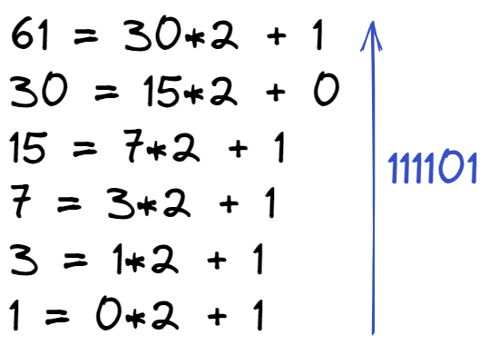

# Двоичная система счисления

Эта система, в основном, используется в вычислительной технике. Почему не стали использовать привычную нам 10-ю? Первую вычислительную машину создал Блез Паскаль, использовавший в ней десятичную систему, которая оказалась неудобной в современных электронных машинах, поскольку требовалось производство устройств, способных работать в 10 состояниях, что увеличивало их цену и итоговые размеры машины. Этих недостатков лишены элементы, работающие в 2-ой системе. Тем не менее, рассматриваемая система была создана задолго до изобретения вычислительных машин и уходит корнями в цивилизацию Инков, где использовались кипу — сложные верёвочные сплетения и узелки.

Двоичная позиционная система счисления имеет основание $2$ и использует для записи числа $2$ символа (цифры): $0$ и $1$. В каждом разряде допустима только одна цифра — либо $0$, либо $1$.

## Из двоичной в десятичную

Для того, чтобы перевести из 2-й в 10-ю необходимо умножить каждую цифру двоичного числа на основание $2$, возведенное в степень, равную разряду. 

Примером может служить число $101_2$.

<figure markdown>
  
  <figcaption>Из двоичной в десятичную</figcaption>
</figure>

$101_2 = 1*2^2 + 0*2^1 + 1*2^0 = 4+0+1 = 5_{10}$.

## Из десятичной в двоичную

Перевести из десятичной системы счисления в двоичную можно с помощью последовательного деления на 2 и записи на каждом из шагов остатков от деления. Полученные остатки от деления переписываются **в обратном порядке**!

Возьмем для примера число $61$

<figure markdown>
  
  <figcaption>Из десятичной в двоичную</figcaption>
</figure>

Таким образом получаем $61_{10}=111101_2$.