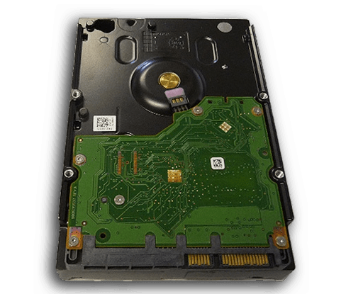
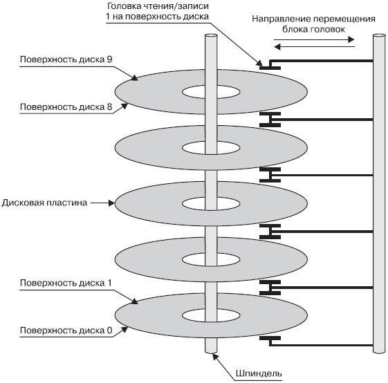

# Жесткие диски

**Жесткий диск** (ЖД, *hard (magnetic) disk drive*, HDD, HMDD ) — это устройство, используемое для хранения цифрового содержимого и других данных на компьютерах, состоящее из намагниченных металлических или стеклянных круглых пластин.

## Устройство жесткого диска компьютера

<figure markdown>
  
  <figcaption>Состав жесткого диска</figcaption>
</figure>

Жесткий диск состоит из пяти основных частей. 

### Интегральная схема

<figure markdown>
  
  <figcaption>Интегральная схема жесткого диска</figcaption>
</figure>

### Электромотор (шпиндель)

Электромотор заставляет вращаться диск со скоростью от 5400 до 15 000 оборотов в минуту. Чем быстрее вращается магнитный диск, тем быстрее компьютер сможет получить доступ к находящейся на нем информации.

### Коромысло со считывающей головкой

Самая важная часть жесткого диска — коромысло, которое может как записывать, так и считывать информацию. Конец коромысла обычно разделен, для того чтобы можно было работать сразу с несколькими дисками. Однако головка коромысла никогда не соприкасается с дисками. Существует зазор между поверхностью диска и головкой, размер этого зазора примерно в пять тысяч раз меньше толщины человеческого волоса.

<figure markdown>
  
  <figcaption>Коромысло со считывающей головкой</figcaption>
</figure>

Головки жестких дисков для записи и чтения используются для ввода единиц и нулей путем намагничивания частей диска. Головка может определять магнетизм каждой части, считывая информацию с нее. Головка, которая может читать данные, способна также записывать их, изменяя намагниченность битов на диске.

### Магнитные пластины

Магнитные пластины — это то, куда записывается и откуда считывается информация. Их может быть несколько.

<figure markdown>
  
  <figcaption>Магнитные пластины</figcaption>
</figure>

Поскольку данные хранятся в намагниченном виде, при отключении питания они не разрушаются, а это означает, что сохраняют данные, даже когда компьютер выключен.

### Корпус

В корпус устанавливаются все остальные компоненты. Почти весь корпус выполнен из пластмассы, но верхняя крышка всегда металлическая. Корпус в собранном виде нередко называют **гермозоной**. Бытует мнение, что внутри гермозоны нет воздуха, а точнее, что там вакуум. Мнение это опирается на тот факт, что при таких высоких скоростях вращения диска, даже пылинка, попавшая внутрь, может натворить много нехорошего. И это почти верно, разве что вакуума там никакого нету — а есть очищенный, осушенный воздух или нейтральный газ — азот, например.

## SSD

**SSD** (твердотельные накопители) — это новый тип жестких дисков. Это предпочтительный тип внутренних жестких дисков самых современных ноутбуков. SSD также используются во всех смартфонах и планшетах.

В твердотельных накопителях применяется флеш-память, как и во флеш-накопителях USB, а также картах памяти для цифровых фотоаппаратов. Здесь нет никаких магнитов; в SSD используются полупроводники, которые хранят данные, изменяя электрическое состояние триллионов цепей, содержащихся в накопителе. Поскольку в SSD нет движущихся частей, они не только работают быстрее (так как вам не нужно ждать, пока диски начнут вращаться и головки считают информацию), но и служат дольше, чем HDD.

SDD намного дороже в производстве, поэтому, хотя они все чаще используются в качестве основных дисковых накопителей для ноутбуков и ПК высокого класса, многие по-прежнему предпочитают жесткие диски как более дешевый вариант.

## Список использованных источников

1. Жесткий диск: что это такое [Электронный ресурс] URL:[https://experience.dropbox.com/ru-ru/resources/what-is-a-hard-drive](https://experience.dropbox.com/ru-ru/resources/what-is-a-hard-drive) (дата обращения: 28.06.2022)
1. Как устроен жесткий диск компьютера (HDD) URL:[http://pc-information-guide.ru/zhestkij-disk/kak-ustroen-zhestkij-disk-kompyutera-hdd.html](http://pc-information-guide.ru/zhestkij-disk/kak-ustroen-zhestkij-disk-kompyutera-hdd.html) (дата обращения: 28.06.2022)
1. Из чего состоит жесткий диск URL:[https://lumpics.ru/what-hdd-consists/](https://lumpics.ru/what-hdd-consists/) (дата обращения: 28.06.2022)

