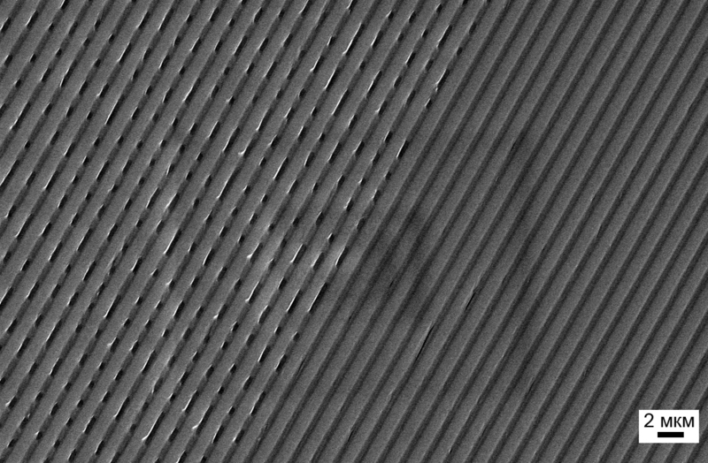

# Оптические диски

**Оптический диск** (ОД, «болванка») — собирательное название для носителей информации, выполненных в виде дисков, запись на которые ведется с помощью оптического излучения. 

Все оптические носители имеют строго определённые размеры. Их толщина составляет 1,2 мм, а диаметр может быть либо 8, либо 12 сантиметров. Все без исключения «болванки» имеют многослойную структуру, которая сильно отличается для разных видов носителей.

Для считывания информации используется луч лазера, который напраляется на специальный слой и отражается от него. При отражении луч искажается мельчайшими выемками на специальном слое. Основу любого ОД составляет прозрачная бесцветная подложка, изготовленная из поликарбоната. 

Подобно пластинкам с граммзаписью информация на оптических дисках записывается по спиральной дорожке. Лазер начинает чтение от внутренней дорожки и завершает на внешней. При воспроизведении лазерный луч направляется на впадины и выступы. Когда луч лазера попадает на выступ, он отражается на свето-чувствительный элемент. Когда луч залетает во впадину, на свето-чувствительный элемент попадает лишь слабый сигнал. Таким способом свето-чувствительный элемент принимает наборы световых импульсов, соответствующие впадинам и выступам на диске.

Данные ОД хранятся в виде очень тонкой спиральной дорожки, нанесенной на специальный защищенный слой диска. Эти углубления (темные участки) называются **питами** (англ. pit — углубление), а промежутки — **лендами** (англ. land — пространство). Под увеличением их можно рассмотреть.

<figure markdown>
  
  <figcaption>Питы и ленды</figcaption>
</figure>

Чтобы было легче представить отношение размеров диска и пита: если компакт-диск был бы величиной со стадион, пит был бы размером примерно с песчинку.

<figure markdown>
  
  <figcaption>Дорожки с информацией и пустые дорожки</figcaption>
</figure>

## Виды оптических носителей

### Compact Disc (CD)

**Компакт-диск** (CD) — оптический носитель информации в виде диска с отверстием в центре, информация с которого считывается с помощью лазера. 

Изначально компакт-диск был создан для цифрового хранения аудио (так называемые Audio-CD), однако в настоящее время широко используется как устройство хранения данных широкого назначения (так называемые CD-ROM).

Аудио-компакт-диски по формату отличаются от компакт-
дисков с данными, и CD-плееры обычно могут воспроизводить только их.

Аббревиатура «CD-ROM» означает «*Compact Disc Read Only Memory*» что в переводе обозначает компакт-диск с возможностью чтения. CD-ROM’ом часто ошибочно
называют CD-привод для чтения компакт-дисков.

#### Типы компакт-дисков

Компакт-диски бывают штампованные на заводе (CD-ROM), CD-R (*Compact Disc Recordable*) для однократной записи, CD-RW (*Compact Disc ReWritable*) для многократной записи. Диски последних двух типов предназначены для записи в домашних условиях на специальных пишущих приводах. В некоторых CD-плеерах и музыкальных центрах такие диски могут не читаться.

Такие диски в просторечии называются «болванками».

Процесс записи называется «**прожигом**» (от англ. «*to burn*») диска.

### DVD

DVD (ди-ви-ди, англ. Digital Versatile Disc — цифровой многоцелевой диск) — носитель информации в виде диска, внешне схожий с компакт-диском, однако имеющий возможность хранить больший объем информации за счет использования лазера с меньшей длиной волны, чем для обычных компакт дисков.

Изначально «DVD» расшифровывалось как «*Digital Video Disc*» (цифровой видеодиск), поскольку данный формат первоначально разрабатывался как замена видеокассетам. Позже, когда стало ясно, что носитель подходит и для хранения произвольной информации, многие стали расшифровывать DVD как *Digital Versatile Disc* (цифровой многоцелевой диск). К консенсусу не пришли до сих пор, поэтому сегодня «DVD» официально вообще никак не расшифровывается.

#### Типы DVD

по структуре данных

- DVD-Video — содержат фильмы (видео и звук);
- DVD-Audio — содержат аудиоданные высокого качества (гораздо выше, чем на аудио-компакт-дисках);
- DVD-Data — содержат любые данные.

В отличие от компакт-дисков, в которых структура аудиодиска фундаментально отличается от диска с данными, в DVD всегда используется одна файловая система.

как носители

- DVD-ROM — диски, изготовленные методом инжекционного литья (литья под давлением из прочного пластика-поликарбоната), непригодны для записи в приводах;
- DVD-R/RW — диски однократной (R — Recordable) и многократной (RW — ReWritable) записи;
- DVD+R/RW — диски однократной (R — Recordable) и многократной (RW — ReWritable) записи;
- DVD-RAM — диски многократной записи с произвольным доступом (RAM — Random Access Memory).

Любой из этих типов носителей DVD может нести любую из трех структур данных (см. выше).

#### Возникновение форматов DVD±R и их совместимость

Стандарт записи DVD-R(W) был разработан в 1997 году как официальная спецификация (пере)записываемых дисков. Однако цена лицензии на эту технологию была слишком высока, и поэтому несколько производителей пишущих приводов и носителей для записи объединились в «DVD+RW Alliance», который и разработал в середине 2002 года стандарт DVD+R(W), стоимость лицензии на который была ниже. Поначалу «болванки» (чистые диски для записи) DVD+R(W) были дороже, чем «болванки» DVD-R(W), но теперь цены сравнялись.

Стандарты записи «$+$» и «$-$» частично совместимы. Все приводы для DVD могут читать оба формата дисков, и большинство пишущих приводов также могут записывать оба типа «болванок». Среди остальных приводов форматы «$+$» и «$-$» одинаково
популярны — половина производителей поддерживает один стандарт, половина — другой.

### Blu-ray Disc (BD)

Blu-ray Disc (BD, англ. blue ray — синий луч) — оптический носитель нового типа, отличающийся еще более высокой плотностью рабочей поверхности и обеспечивающий хранение значительного объема данных В названии Blu-ray буква «*e*» была умышленно пропущена разработчиками, чтобы иметь возможность зарегистрировать торговый знак.

Оптический привод для записи и чтение BD оснащен сверхтонким **синим** лазером с очень короткой волной (405 нм), благодаря чему ширина дорожки на диске сужена до 0,32 мкм, что вдвое меньше, чем на DVD. Увеличился не только объем хранимых данных, но и скорость их считывания. В несколько раз стал тоньше и защитный слой, но благодаря использованию новых материалов, Blu-ray Disc боится царапин не больше, чем оптические носители других типов.

Современные технологии позволяют записывать на один BD несколько слоев, каждый из которых может содержать 23,3 ГБ данных. Распространенными являются диски с количеством слоев до 4. Существуют прототипы емкостью до 500 ГБ, содержащие 15-20 слоев.

## Список использованных источников

1. Как устроены оптические диски [Электронный ресурс] URL:[https://mydiv.net/arts/view-kak_ustroeny_opticheskie_diski.html](https://mydiv.net/arts/view-kak_ustroeny_opticheskie_diski.html) (дата обращения: 27.06.2022)
1. Типы оптических дисков [Электронный ресурс] URL:[https://www.chaynikam.info/stat_cd.html](https://www.chaynikam.info/stat_cd.html) (дата обращения: 27.06.2022)
1. Взгляд изнутри: CD и HDD [Электронный ресурс] URL:[https://habr.com/ru/post/129893/](https://habr.com/ru/post/129893/) (дата обращения: 28.06.2022)