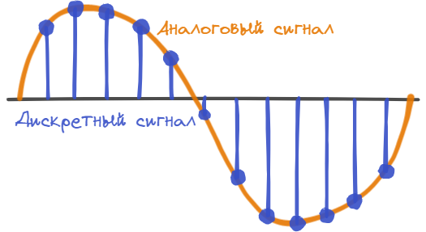

# Цифровой и аналоговый сигналы

В технических отраслях знаний термин **сигнал** (*signal*, от латинского *signum* — знак) очень часто используется в широком смысловом диапазоне, без соблюдения строгой терминологии. Под ним понимают и носитель информации (электрический, магнитный, оптический сигнал), и физический процесс, представляющий собой изменение какого-либо параметра носителя информации (напряжения, частоты, мощности электромагнитных колебаний, интенсивности светового потока и т.п.), и смысловое содержание определенного физического состояния или процесса, (сигналы светофора, звуковые предупреждающие сигналы и т.п). 

Одно общее свойство, присущее всем сигналам — это способность к переносу **информации**.

Любой сигнал может быть представлен в виде функции, которая описывает изменения его характеристик. Такое представление удобно для изучения устройств и систем радиотехники. Математическая модель сигнала в исследованиях позволяет опираться на параметры функции времени.

## Аналоговые сигналы

Аналоговые сигналы наиболее привычны для нас. Можно сказать, что весь окружающий природный мир вокруг нас — аналоговый. Наши зрение и слух, а также все остальные органы чувств воспринимают поступающую информацию в аналоговой форме, то есть непрерывно во времени. 

**Аналоговый** сигнал непрерывен во времени и по амплитуде. Для любого момента времени можно определить точное значение амплитуды аналогового сигнала.

Вот пример звукового сигнала.

<figure markdown>
  
  <figcaption>Аналоговый сигнал</figcaption>
</figure>

В электронике аналоговый сигнал основан на передаче электричества.

Сейчас аналоговые сигналы еще применяются в телевидении и радио, для преобразования входного сигнала в микрофонах. Но, в целом, этот тип сигнала повсеместно вытеснен или вытесняется цифровыми сигналами.

## Дискретный сигнал

Дискретные сигналы — это сигналы, которые представляют собой последовательность отчетов или измерений какой-либо величины. Измерения таких сигналов не непрерывны.

Термометр измеряет аналоговую величину. Но вы, фактически следя за его показаниями, получаете дискретную информацию. **Дискретный** — значит отдельный.

Например, вы проснулись и узнали, сколько градусов на термометре, в следующий раз вы на него посмотрели на градусник в полдень, и третий раз вечером. Вы не знаете, с какой скоростью изменялась температура, равномерно, или резким скачком, вы знаете только данные в тот момент времени, который наблюдали.

<figure markdown>
  
  <figcaption>Аналоговый и дискретный сигналы</figcaption>
</figure>

## Цифровой сигнал

Цифровой сигнал — это такой дискретный сигнал, который может принимать по амплитуде только определенные значения.

<figure markdown>
  
  <figcaption>Аналоговый и цифровой сигналы</figcaption>
</figure>

Цифровой сигнал легко записывается и перезаписывается в память вычислительных устройств, просто считывается и копируется без потери точности, тогда как перезапись аналогового сигнала всегда сопряжена с утратой некоторой, пусть и незначительной, части информации.

Обработка цифровых сигналов позволяет получать устройства с очень высокими характеристиками благодаря выполнению вычислительных операций совершенно без потерь качества, либо с пренебрежимо малыми потерями

В силу этих достоинств, именно цифровые сигналы повсеместно распространены сегодня в системах хранения и обработки данных. Вся современная память — цифровая. Аналоговые носители информации (такие как пленочные кассеты и т.д.) давно ушли в прошлое.

## Список использованных источников

1. Основы цифрового звука (перевод) [Электронный ресурс] URL: [https://audiomania.livejournal.com/271540.html](https://audiomania.livejournal.com/271540.html) (дата обращения: 17.02.2022)
1. Чем отличаются аналоговый сигнал от цифрового — примеры использования [Электронный ресурс] URL: [https://odinelectric.ru/knowledgebase/chem-otlichayutsya-analogoviy-signal-ot-tsyfrovogo](https://odinelectric.ru/knowledgebase/chem-otlichayutsya-analogoviy-signal-ot-tsyfrovogo) (дата обращения: 28.02.2022)
1. Аналоговый и цифровой сигнал. Типы сигналов и как это действует [Электронный ресурс] URL: [https://electrosam.ru/glavnaja/jelektrotehnika/raschjoty/analogovyi-i-tsifrovoi-signal/](https://electrosam.ru/glavnaja/jelektrotehnika/raschjoty/analogovyi-i-tsifrovoi-signal/) (дата обращения: 28.02.2022)
1. Аналоговые, дискретные и цифровые сигналы [Электронный ресурс] URL: [http://electricalschool.info/automation/2238-analogovye-diskretnye-i-cifrovye-signaly.html](http://electricalschool.info/automation/2238-analogovye-diskretnye-i-cifrovye-signaly.html) (дата обращения: 28.02.2022)